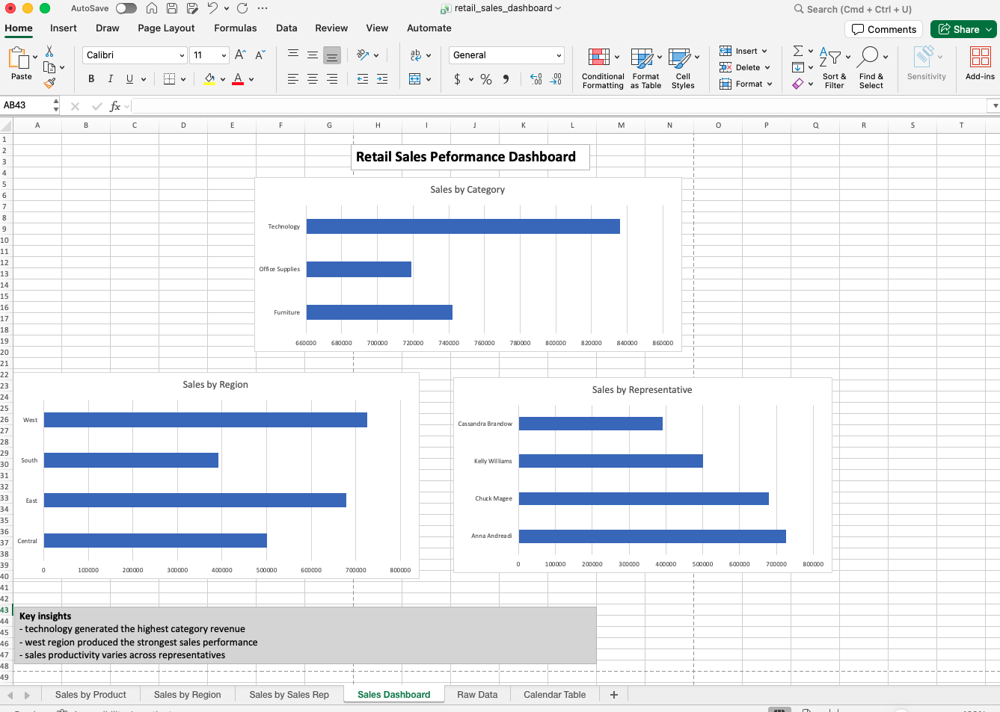
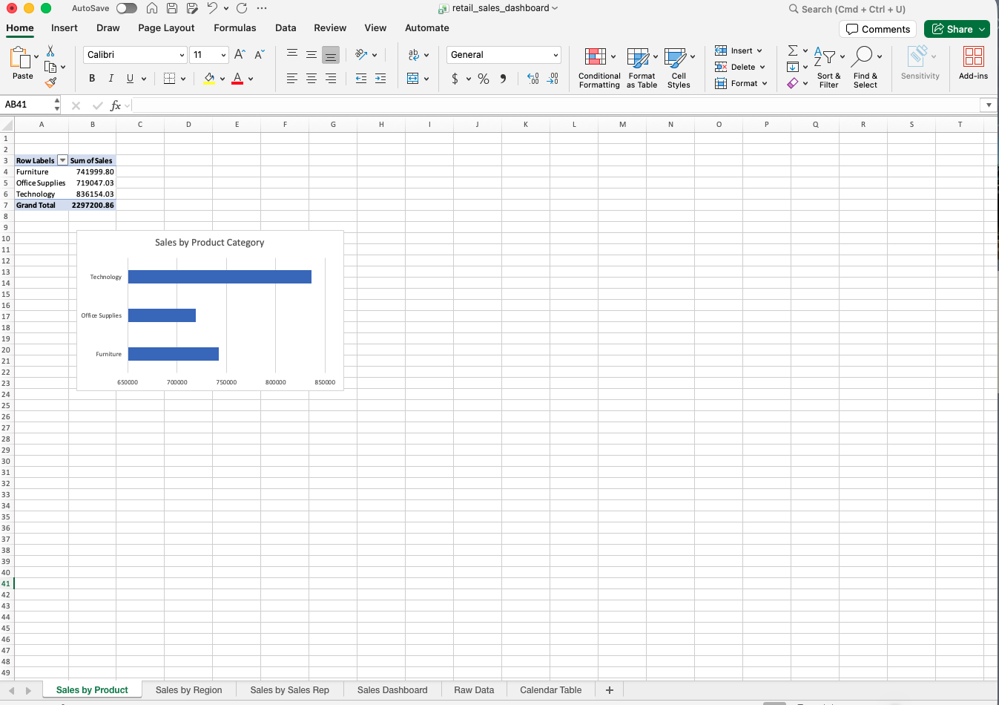
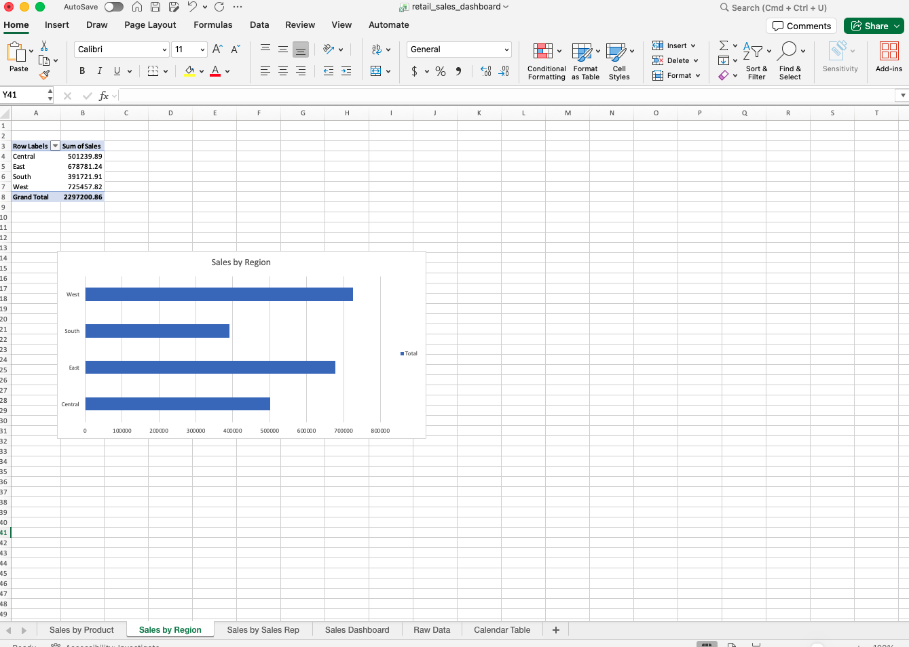

# retail-sales-excel-dashboard
Excel dashboard analyzing retail sales performance using pivot tables, charts, and data visualization techniques.

# Retail Sales Excel Dashboard

## Overview
This project analyzes retail sales performance using Excel to identify trends across product categories, regions, and sales representatives.

## Tools Used
- Microsoft Excel
- Pivot Tables
- Data Visualization (charts and dashboard)

## Dataset
The dataset includes retail sales transactions with information on revenue, product categories, regions, and sales representatives.

## Business Questions
- Which product categories generate the most revenue?
- Which regions perform the best?
- How does sales performance vary by sales representative?

## Process
- Cleaned and structured the dataset in Excel
- Created pivot tables to summarize key metrics
- Built a dashboard to visualize performance across categories, regions, and sales reps
- Analyzed trends to identify key business insights

## Key Findings

- Technology generated the highest revenue among product categories, indicating strong demand.
- The West region produced the highest sales, suggesting a key geographic market.
- Sales performance varies across representatives, highlighting opportunities for optimization.
- Revenue is driven more by top-performing categories and regions rather than evenly distributed sales.
  

## Dashboard Preview

### Full Dashboard Overview
This dashboard summarizes retail sales performance across product categories, regions, and sales representatives.

### Sales by Category

### Sales by Region

## Files
- `retail_sales_dashboard.xlsx` → Excel dashboard file

## What I Learned
This project strengthened my ability to use Excel for data analysis, build dashboards, and communicate insights effectively.
